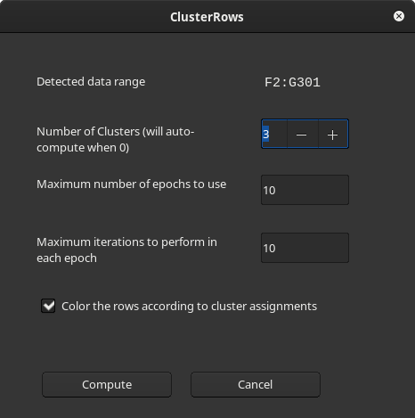
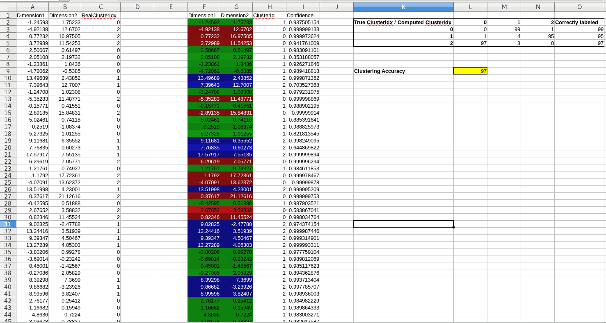
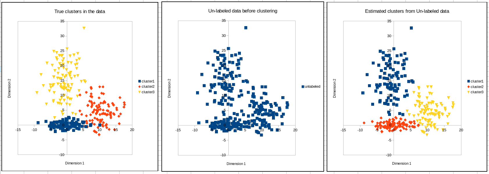

# ClusterRows

A LibreOffice Calc extension that clusters the rows in a table and colors them to indicate the clusters.

## Install
Use the extension manager of LibreOffice to install the pre-built extension downloaded from the Release page. Alternatively you can install the downloaded extension from the console as:
```
$ unopkg install <path-to-downloaded-extension>/ClusterRows.oxt
```

## How to use?

1. Place the cursor on any cell inside your table with data (no need to select the whole table)
2. Either click the toolbar item named `Cluster rows`  which is next to the AutoFilter item or click on the `Clustering...` menu item under `Data > Statistics`.
3. Now a dialog will appear where the parameters of clustering can be set. It is also possible to specify whether the data rows need to be colored according to the cluster assignments.
   
4. After pressing the *Compute* button, two new columns [ClusterId and Confidence] are added to the right of the table. **ClusterId** specifies the cluster to which the row is assigned and **Confidence** indicates the algorithm's confidence in scale [0,1] that this cluster assignment may be correct (higher number implies higher confidence). Depending on the choice provided in the dialog, the data rows are colored according to the cluster assignments.

## Advanced usage via `GMMCLUSTER` formula

The dialog based clustering (described above) uses an in-house array formula `GMMCLUSTER` to compute the clusters and confidence scores. Hence it is possible to directly use this array formula to compute the clusters instead of using the dialog. Doing so has the advantage of specifying the exact data-range (without the header) and placement of the results. In addition the parameters (including the data-range) could be specified programatically as functions of other cells/ranges in general. The syntax of `GMMCLUSTER` is:
```
GMMCLUSTER(data, numClusters, numEpochs, numIterations)
```
where **data** is the array(cell-range) holding the data, **numClusters** is the desired number of clusters (optional, default is to automatically estimate this), **numEpochs** is the maximum number of epochs to use (optional) and **numIteration** is the maximum number iterations to do in each epoch (optional). Note that `Ctrl+Shift+Enter` is needed to commit the array formula after entering the formula expression.

## Implementation

The project uses an in-house implementation of full [Expectation Maximization](https://en.wikipedia.org/wiki/Expectation%E2%80%93maximization_algorithm) algorithm to compute the clusters. In the auto mode (when number of clusters is specified as 0) it chooses the number of clusters parameter via [Bayesian information criterion](https://en.wikipedia.org/wiki/Bayesian_information_criterion).

The project does not depend on any machine learning or linear algebra libraries. Full source code is made available under [GPL3 license](https://www.gnu.org/licenses/gpl-3.0.en.html).

## Planned features

* Support for Windows and MacOSX. As of the present release, only Linux is supported.
* Optional 'seed' (5th) parameter for `GMMCLUSTER()` to make the results reproducible.
* Editing of input data range (with/without header) in the dialog
* Allow placement of computed results at any place in the sheet via dialog.
* Add support for other common clustering algorithms.

## Sample usage of the extension
In `testdocs` directory there is a spreadsheet file called `three-clusters.ods`. In that sheet there is a dataset in the range `A1:C301` synthetically  generated from a 3-cluster Gaussian mixture model. This toy dataset has two dimensions/variables(column A and B). Column C has the ground truth cluster id information of each row. To test the extension a copy of the dataset is placed(excluding the ground-truth column) at `F1:G301`. Now place the cursor anywhere in the range `F1:G301` and go to the menu `Data > Statistics > Clustering...` and click `Compute` button in the dialog. The extension will compute the 3 clusters and produce the columns `ClusterId` and `Confidence` next to the data. The cell `L9` in that sheet will indicate the clustering accuracy. This is a measure of how well the clustering algorithm was able to assign clusters compared to the ground truths in the original dataset. Typically we get around 97% accuracy for this dataset.

The document also contains visualizations of the data in the sheet `charts`. The left chart shows the data points colored according to the ground truth clusters of the dataset. The middle chart shows the data points without the cluster information (which is the input to the clustering algorithm). The right chart shows the data colored according to the cluster assignments made by the algorithm.


## Building the extension from source

1. Setup LibreOffice SDK. See [http://api.libreoffice.org/docs/install.html](http://api.libreoffice.org/docs/install.html).
Then run `make` in the project's root directory. After this the extension file `ClusterRows.oxt` can be found in `build/extension/`. Running `make install` will install the extension to Calc (via `unopkg install` command).

If you get errors on running `make`, check if the SDK's environment variables are set properly after setting up the SDK. If the errors persist, please open an issue here.

As always pull-requests are welcome. Happy hacking !
