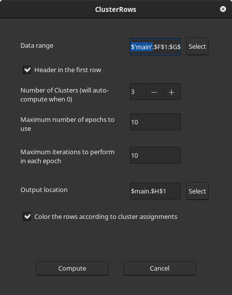
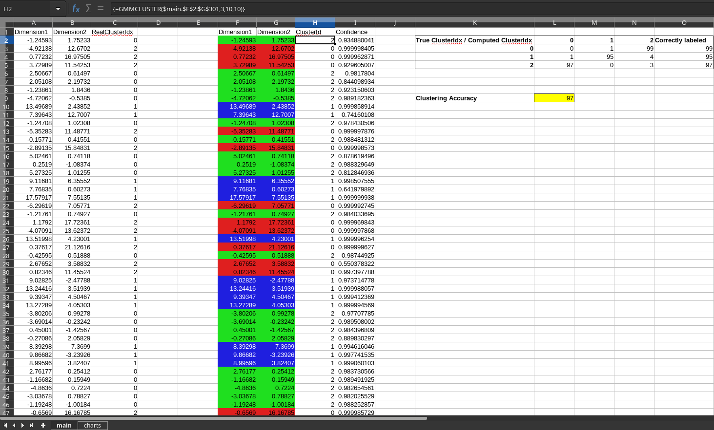

# ClusterRows

ClusterRows is a LibreOffice Calc extension that clusters the rows in a table and colors them to indicate the clusters.

## Install
Use the extension manager of LibreOffice to install the pre-built extension downloaded from the Release page. Alternatively you can install the downloaded extension from the console as:
```
$ unopkg install <path-to-downloaded-extension>/ClusterRows.oxt
```

## What's new?
* Support for Windows and MacOSX
  * Platform specific extension packages in the Release page.
* Dialog based workflow
* GMMCluster() formula
* Input range and the output location may be selected interactively and edited in the dialog

## How to use?

1. Click the toolbar item named `Cluster rows`  which is next to the AutoFilter item or click on the `Clustering...` menu item under `Data > Statistics`.
2. Now a dialog will appear where the input data cell-range(with or without header), the output location and the parameters of clustering can be set. If the input cell range was selected before launching the dialog then these two fields will be pre-filled. By default the output location is set to the column next to the last column of the input data cell-range for convenience. If the first row of the input range has the column headers then it can be specified by checking the `Header in the first row` checkbox. It is also possible to specify whether the data rows need to be colored according to the cluster assignments.\

3. After pressing the *Compute* button, two new columns [ClusterId and Confidence] will be written to the user specified output location. These two columns will have headers if the dialog option `Header in the first row` was checked. The first column **ClusterId** specifies the cluster to which the row is assigned and the second column **Confidence** indicates the algorithm's confidence in scale [0,1] that this cluster assignment may be correct (higher number implies higher confidence). Depending on the choice provided in the dialog, the data rows are colored according to the cluster assignments.

## Advanced usage via `GMMCLUSTER` formula

The dialog based clustering (described above) uses an in-house array formula `GMMCLUSTER` to compute the clusters and confidence scores. Hence it is possible to directly use this array formula to compute the clusters instead of using the dialog. Doing so has the advantage of specifying the exact data-range (without the header) and placement of the results. In addition the parameters (including the data-range) could be specified programatically as functions of other cells/ranges in general. The syntax of `GMMCLUSTER` is:
```
GMMCLUSTER(data, numClusters, numEpochs, numIterations)
```
where **data** is the array(cell-range) holding the data, **numClusters** is the desired number of clusters (optional, default is to automatically estimate this), **numEpochs** is the maximum number of epochs to use (optional) and **numIteration** is the maximum number of iterations to do in each epoch (optional). Note that after entering the formula expression remember to press `Ctrl+Shift+Enter` instead of just `Enter` to commit the array formula.

## Implementation

The project uses an in-house C++ implementation of full [Expectation Maximization](https://en.wikipedia.org/wiki/Expectation%E2%80%93maximization_algorithm) algorithm to compute the clusters. In the auto mode (when number of clusters is specified as 0) it chooses the number of clusters parameter via [Bayesian information criterion](https://en.wikipedia.org/wiki/Bayesian_information_criterion).

The project does not depend on any machine learning or linear algebra libraries. Full source code is made available under [GPL3 license](https://www.gnu.org/licenses/gpl-3.0.en.html).

## Planned features

* Optional 'seed' (5th) parameter for `GMMCLUSTER()` to make the results reproducible.
* Add support for other common clustering algorithms.

## Sample usage of the extension
In `testdocs` directory there is a spreadsheet file called `three-clusters.ods`. In that sheet there is a dataset in the range `A1:C301` synthetically  generated from a 3-cluster Gaussian mixture model. This toy dataset has two dimensions/variables(column A and B). Column C has the ground truth cluster id information of each row. To test the extension a copy of the dataset is placed(excluding the ground-truth column) at `F1:G301`. Go to the menu `Data > Statistics > Clustering...` and select or enter the input data range `F1:G301` and check the option `Header in the first row` and click `Compute` button in the dialog. The extension will compute the 3 clusters and produce the columns `ClusterId` and `Confidence` next to the data. The cell `L9` in that sheet will indicate the clustering accuracy. This is a measure of how well the clustering algorithm was able to assign clusters compared to the ground truths in the original dataset. Typically we get around 97% accuracy for this dataset.



The document also contains visualizations of the data in the sheet `charts`. The left chart shows the data points colored according to the ground truth clusters of the dataset. The middle chart shows the data points without the cluster information (which is the input to the clustering algorithm). The right chart shows the data colored according to the cluster assignments made by the algorithm.


## Building the extension from source

This is known to work only in GNU/Linux systems. Builds for Windows and MacOS can be done using cmake toolchain files provided with the project.
1. Install `cmake` and optionally `ccmake`. In Ubuntu 20.04+ `sudo apt install cmake cmake-curses-gui` will install them.
2. Install LibreOffice SDK. For instance in Ubuntu 20.04+ `sudo apt install libreoffice-dev` will install it.
3. In the terminal go to `<project root>/build/linux/`
   * Run `cmake ../../ -DCMAKE_BUILD_TYPE=RelWithDebInfo`
   * Run `make ClusterRows`
     * Alternatively run `make deploy` to build and deploy this extension to the default LibreOffice installation.
     * Or run `make deployrun` to build, deploy and start LibreOffice Calc with a test document.
       * See the debug logs using `make showlogs`

The built extensions will be placed in `<project root>/extension`. When building for Linux, this file is named `ClusterRows-Linux.oxt` which can be manually installed by invoking `unopkg install <extension file>`.

If you get errors on running any of these commands or if you want to report any bug please open an issue here.

As always pull-requests are welcome. Happy hacking!
